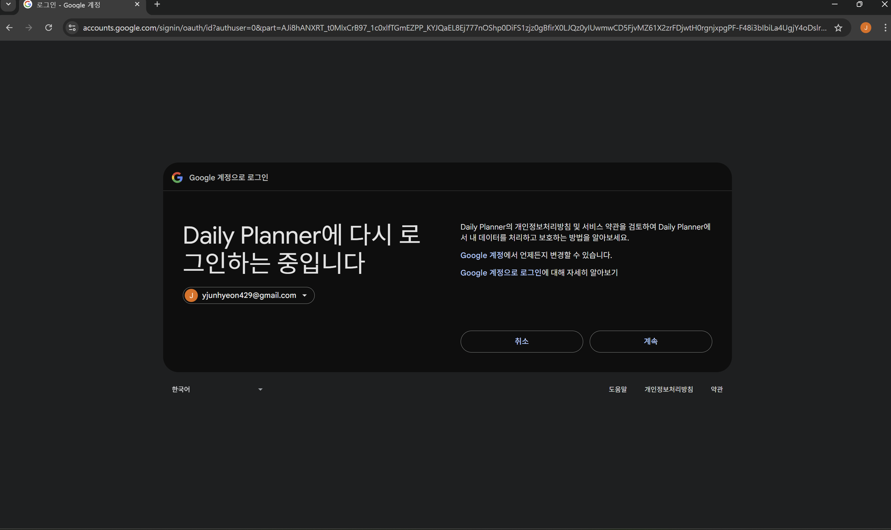
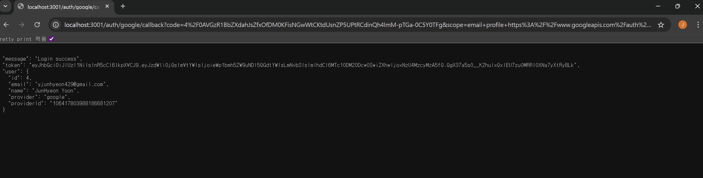
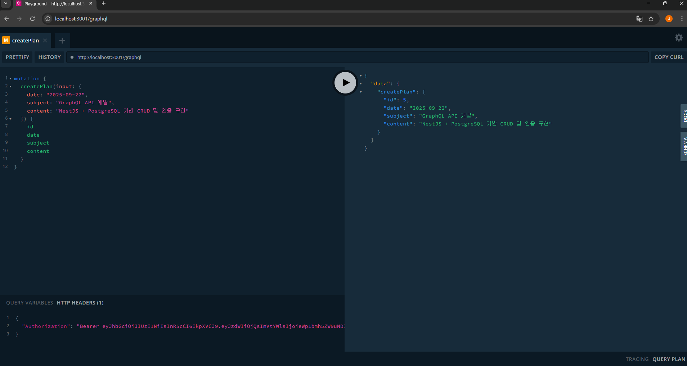

# 📑 Daily Planner

NestJS + GraphQL + PostgreSQL + Google OAuth 기반 개인 학습/업무 플래너 서비스

---

## 🚀 프로젝트 개요

* **목적**: 일간 학습/업무 계획을 등록하고 관리할 수 있는 풀스택 서비스
* **기술 스택**:

  * **Backend**: NestJS, GraphQL (Apollo Driver), TypeORM
  * **Database**: PostgreSQL
  * **Auth**: Google OAuth 2.0 + JWT 기반 인증/인가
  * **Infra**: Node.js 실행 환경 (Docker 배포 확장 가능)

---

## 🛠️ 주요 기능

* **회원 관리**

  * Google OAuth 로그인 → 사용자 자동 생성
  * JWT 토큰 발급 및 GraphQL 요청 인증
* **스터디 플랜 관리**

  * 플랜 생성(Create) / 조회(Read) / 수정(Update) / 삭제(Delete)
  * 사용자별 플랜, 특정 날짜/기간별 플랜 조회 지원
* **보안**

  * GraphQL Mutation(`createPlan`, `updatePlan`, `deletePlan`) → 인증 사용자만 접근 가능
  * JWT 기반 GqlAuthGuard 적용

---

## 📂 프로젝트 구조

```
src
 ┣ auth/         # Google OAuth + JWT 인증 모듈
 ┣ plans/        # StudyPlan 엔티티 및 CRUD 서비스
 ┣ users/        # User 엔티티 및 사용자 관리
 ┣ app.module.ts # 전역 모듈 설정 (DB, GraphQL, Config)
 ┗ main.ts       # 서버 부트스트랩
```

---

## 📌 DB 스키마

### users

| Column     | Type   | Description       |
| ---------- | ------ | ----------------- |
| id         | int PK | 사용자 고유 ID         |
| email      | string | 이메일 (unique)      |
| name       | string | 사용자 이름            |
| provider   | string | 로그인 제공자 (google)  |
| providerId | string | OAuth provider ID |

### study\_plans

| Column  | Type   | Description       |
| ------- | ------ | ----------------- |
| id      | int PK | 플랜 ID             |
| date    | string | YYYY-MM-DD 형식 날짜  |
| subject | string | 플랜 제목/과목          |
| content | string | 상세 내용 (nullable)  |
| userId  | int FK | 사용자 ID (users.id) |

---

## 🔑 인증 흐름

1. 사용자가 **/auth/google** 로그인 시도
2. Google OAuth 콜백 성공 시 DB에 사용자 생성/갱신
3. JWT 토큰 발급 후 클라이언트에 전달
4. 이후 GraphQL Playground/Postman에서 Authorization 헤더에 토큰 추가
5. 인증된 사용자 기준으로 CRUD 요청 처리

---

## 📦 실행 방법

### 1. 환경변수 설정

`.env`

```env
DB_HOST=localhost
DB_PORT=5432
DB_USER=postgres
DB_PASS=비밀번호
DB_NAME=daily_planner

JWT_SECRET=임의의_시크릿값

GOOGLE_CLIENT_ID=발급받은_ID
GOOGLE_CLIENT_SECRET=발급받은_SECRET
GOOGLE_CALLBACK_URL=http://localhost:3001/auth/google/callback
```

### 2. 서버 실행

```bash
npm install
npm run start:dev
```

### 3. 테스트

* `http://localhost:3001/auth/google` → OAuth 로그인
* `http://localhost:3001/graphql` → GraphQL Playground 접속
* Authorization 헤더에 JWT 토큰 추가 후 API 호출

---

## OAuth 로그인


## JWT


## GraphQL Create Plan


## ✨ 특징

* **OAuth2.0 + JWT** 인증을 직접 구현 (Firebase 미사용)
* **GraphQL Code-first** 방식 적용
* **TypeORM** 기반 PostgreSQL 연동 및 관계 매핑 (`User` ↔ `StudyPlan`)
* **확장성 고려**: 모듈 구조 기반으로 CRUD 및 인증 로직을 분리

---

## 📌 배운 점

* NestJS에서 GraphQL/TypeORM 통합 및 모듈화 패턴 이해
* Google OAuth와 JWT를 연계해 인증/인가 흐름 구축
* RDB 스키마 설계와 실제 API CRUD 연동 경험
* 포트폴리오 수준의 **엔드투엔드 인증 + CRUD 백엔드 서버** 구현
